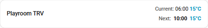
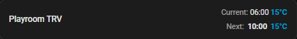
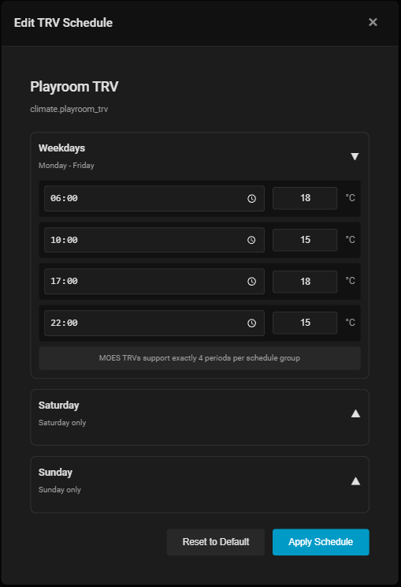

# MOES TRV Schedule Card

A custom Home Assistant Lovelace card for managing weekly heating schedules on MOES Thermostatic Radiator Valves (TRVs).


## Screenshots

### Compact Card View

The card displays a compact summary of your TRV schedule, showing the current slot and next transition.

| Light Theme | Dark Theme |
|-------------|------------|
|  |  |

### Schedule Editor Dialog

Click the card to open the full schedule editor with accordion-style day panels.



**Features:**
- **Compact Dashboard Display:** Shows current schedule slot time, temperature, and next transition
- **Click-to-Edit:** Click anywhere on card to open the full editor
- **Full Schedule Editor (Dialog):** Configure Weekdays, Saturday, and Sunday schedules with 4 time periods each
- **Accordion Interface:** Only one day panel open at a time for focused editing
- **Smart Defaults:** Opens with current day's schedule visible

## Features

- 📊 **Compact Display** - Shows next scheduled transition time and temperature on dashboard
- 📅 **Three Schedule Groups** - Configure Weekdays, Saturday, and Sunday schedules
- ⏰ **Four Time Periods** - Set 4 temperature periods per schedule group (MOES TRV standard)
- 🌡️ **Temperature Control** - Easy temperature adjustment for each period
- 🎨 **Modern UI** - Clean, responsive design that matches Home Assistant's interface
- 🖱️ **Click-to-Edit** - Click the card to open full schedule editor in dialog popup
- 🔄 **Real-time Updates** - Changes apply immediately to your MOES TRV
- 🎯 **Visual Editor** - Intuitive configuration through the Lovelace UI
- ✅ **MOES Format** - Generates correct schedule format with double-space separators

## Installation

### HACS (Recommended)

#### If available in HACS Default:
1. Open HACS in your Home Assistant instance
2. Click on "Frontend"
3. Click the "+" button in the bottom right
4. Search for "MOES TRV Schedule Card"
5. Click "Install"
6. Restart Home Assistant

#### As Custom Repository:
1. Open HACS in your Home Assistant instance
2. Click on "Frontend" → Menu (⋮) → "Custom repositories"
3. Add repository: `https://github.com/BenWolstencroft/home-assistant-moes-trv-schedule-card`
4. Category: `Lovelace`
5. Click "Add"
6. Find "MOES TRV Schedule Card" and click "Download"
7. Restart Home Assistant

### Manual Installation

1. Download `moes-trv-schedule-card.js` and `moes-trv-schedule-card-editor.js`
2. Copy both files to your `config/www` directory
3. Add the following to your `configuration.yaml`:

```yaml
lovelace:
  resources:
    - url: /local/moes-trv-schedule-card.js
      type: module
```

4. Restart Home Assistant
5. Clear your browser cache

## Configuration

### Using the Visual Editor

1. Go to your Lovelace dashboard
2. Click the three dots menu and select "Edit Dashboard"
3. Click "+ Add Card"
4. Search for "MOES TRV Schedule Card"
5. Select your MOES TRV entity
6. Configure additional options as needed
7. Click "Save"

### Manual Configuration (YAML)

Add the following to your Lovelace configuration:

```yaml
type: custom:moes-trv-schedule-card
entity: climate.bedroom_trv
```

### Configuration Options

| Option | Type | Default | Description |
|--------|------|---------|-------------|
| `entity` | string | **Required** | Entity ID of your MOES TRV schedule (text.* or climate.*) |
| `title` | string | `TRV Schedule` | Custom card title |
| `show_current_temp` | boolean | `true` | Show current temperature |
| `min_temp` | number | `5` | Minimum allowed temperature (°C) |
| `max_temp` | number | `35` | Maximum allowed temperature (°C) |
| `temp_step` | number | `0.5` | Temperature adjustment step (°C) |
| `time_format` | string | `24h` | Time format: `24h` or `12h` |

### Full Configuration Example

```yaml
# For Zigbee/MQTT devices with text entity
type: custom:moes-trv-schedule-card
entity: text.living_room_trv_schedule
title: Living Room Heating Schedule
show_current_temp: true
min_temp: 10
max_temp: 28
temp_step: 0.5
time_format: 24h
```

```yaml
# For Tuya/Climate entities
type: custom:moes-trv-schedule-card
entity: climate.living_room_trv
title: Living Room Heating Schedule
show_current_temp: true
min_temp: 10
max_temp: 28
temp_step: 0.5
time_format: 24h
```

## Usage

### Compact Display

The card shows a minimal dashboard view with:
- **Entity Name**: Your TRV device name
- **Next Transition**: The next scheduled temperature change (time and target temperature)
- **Current Temperature**: The current temperature reading (if available)

**Click anywhere on the card to open the full schedule editor.**

### Editing the Schedule

1. **Open Editor**: Click on the compact card to open the schedule editor dialog
2. **Expand a Schedule Group**: Click on Weekdays, Saturday, or Sunday header to expand/collapse
3. **Modify Times**: Click on the time input to set when the temperature should change
4. **Set Temperatures**: Adjust the temperature for each of the 4 periods
5. **Apply**: Click "Apply Schedule" to send the schedule to your TRV
6. **Close**: Click the × button or click outside the dialog to close

### Schedule Format

MOES TRVs support **three schedule groups**, each with **exactly 4 time periods**:

- **Weekdays** (Monday-Friday): 4 periods
- **Saturday**: 4 periods  
- **Sunday**: 4 periods

**Note**: The 4-period limit per group is a MOES TRV hardware limitation. You cannot add or remove periods, only modify the times and temperatures.

### Default Schedule

**Weekdays** (Mon-Fri):
- **06:00** - 18°C (Morning warmup)
- **10:00** - 15°C (Economy during day)
- **17:00** - 18°C (Evening warmup)
- **22:00** - 15°C (Night setback)

**Saturday & Sunday**:
- All periods set to 15°C (customize as needed)

### Schedule String Format

The card generates schedules in MOES TRV format:
```
"06:00/18°C  10:00/15°C  17:00/18°C  22:00/15°C  06:00/15°C  10:00/15°C  17:00/15°C  22:00/15°C  06:00/15°C  10:00/15°C  17:00/15°C  22:00/15°C"
```

Note the double-space separators between each period (4 weekday + 4 Saturday + 4 Sunday = 12 periods total).

### Tips

- **Energy Saving**: Lower temperatures during work hours and overnight
- **Weekend Comfort**: Set Saturday/Sunday for lazy mornings or all-day comfort
- **Consistent Scheduling**: Keep similar times across all groups for routine
- **Reset**: Use "Reset to Default" to start over if needed

## Compatibility

This card is designed to work with MOES TRVs integrated into Home Assistant through:

- **Zigbee (MQTT/Text Entity)** - For Zigbee-based MOES TRVs exposed as text entities (recommended)
- **Tuya Integration** - For Tuya/WiFi MOES devices
- **Zigbee2MQTT** - For Zigbee-based MOES TRVs
- **ZHA (Zigbee Home Automation)** - Native Zigbee integration

### Entity Types Supported

- `text.*` entities - Common for Zigbee devices with schedule attributes
- `climate.*` entities - Traditional climate/thermostat entities

### MOES TRV Models

Tested and compatible with:

- MOES BRT-100-TRV
- MOES HY368 / HY369
- MOES ZigBee TRV
- Similar Tuya-based TRVs

## Troubleshooting

### Card Not Appearing

1. Verify the files are in `config/www`
2. Clear your browser cache (Ctrl + Shift + R)
3. Check browser console for errors (F12)
4. Ensure the resource is added to `configuration.yaml`

### Schedule Not Applying

1. **For text entities**: Verify the entity accepts the `text.set_value` service
2. **For climate entities**: Check that your TRV integration supports schedule setting
3. Check Home Assistant logs for error messages
4. Ensure your TRV is online and responding
5. Verify the schedule string format matches what your device expects

### Entity Not Found

1. Verify the entity ID is correct (check for `text.*_schedule` or `climate.*` entities)
2. For Zigbee devices, ensure the schedule entity is exposed to Home Assistant
3. Check that your TRV is properly integrated in Home Assistant
4. Try using Developer Tools > States to confirm the entity exists and its type

## Development

This card is built using:

- Vanilla JavaScript (ES6+)
- Web Components API
- Home Assistant Frontend APIs

### Building from Source

```bash
# Clone the repository
git clone https://github.com/BenWolstencroft/home-assistant-moes-trv-schedule-card.git

# Navigate to the card directory
cd home-assistant-moes-trv-schedule-card

# Copy to your Home Assistant instance
cp *.js /path/to/homeassistant/config/www/
```

## Contributing

Contributions are welcome! Please:

1. Fork the repository
2. Create a feature branch
3. Make your changes
4. Test thoroughly
5. Submit a pull request

## Support

- **Issues**: [GitHub Issues](https://github.com/BenWolstencroft/home-assistant-moes-trv-schedule-card/issues)
- **Discussions**: [Home Assistant Community](https://community.home-assistant.io/)

## License

MIT License - see LICENSE file for details

## Acknowledgments

- Home Assistant Community
- MOES for creating affordable smart TRVs
- Contributors and testers

---

**Note**: This is a frontend card only. It requires that your MOES TRV integration supports schedule management through Home Assistant services. Check your specific integration's documentation for service call requirements.
